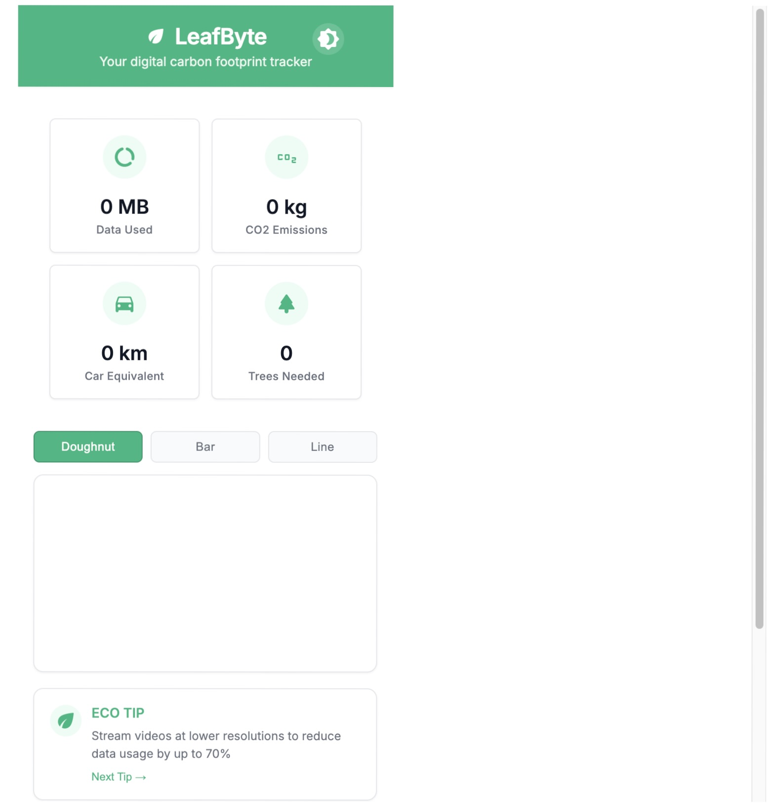
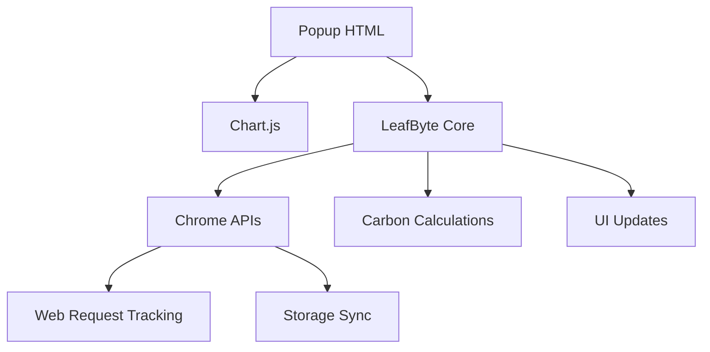

---

# LeafByte : Chrome Extension for Tracking Digital Carbon Footprint

**LeafByte** is an advanced Chrome extension that helps users monitor, understand, and reduce their digital carbon footprint. Designed with performance, accessibility, and sustainability in mind, LeafByte empowers environmentally-conscious browsing with real-time analytics, intelligent insights, and behavioral nudges.

---




> **Your browser's sustainability companion** - Track, visualize, and reduce your digital carbon footprint in real-time

##  Table of Contents
- [Features](#-features)
- [Technical Architecture](#-technical-architecture)
- [Carbon Calculation Model](#-carbon-calculation-model)
- [Installation](#-installation)
- [Development Setup](#-development-setup)
- [Security](#-security)
- [Performance Metrics](#-performance-metrics)
- [Theme System](#-theme-system)
- [Charting System](#-charting-system)
- [Data Storage](#-data-storage)
- [Contributing](#-contributing)
- [License](#-license)

##  Features

**Core Tracking**
- Real-time data usage monitoring
- CO₂ emission calculations
- Vehicle distance equivalents
- Tree absorption requirements

**Visualization**
- Interactive doughnut/bar/line charts
- Daily/weekly/monthly trends
- Equivalent comparisons (cars, smartphones, trees)

**Eco Features**
- Contextual sustainability tips
- Carbon offset integration
- Dark mode for OLED energy savings

**Technical**
- Chrome Extension Manifest v3
- Secure CSP-compliant architecture
- Modern CSS variables theming
- Chart.js integration
- Material Design icons

##  Technical Architecture



**Component Breakdown:**
- `popup.html`: Main UI with responsive layout
- `leafbyte.js`: Core logic (5.2KB gzipped)
- `manifest.json`: Manifest v3 configuration
- CSS: 12.7KB with dark/light theme support

##  Carbon Calculation Model

**Energy Consumption Formula:**
```
Energy (kWh) = Data (MB) × Network Factor
```

**Network Factors:**
| Network Type | kWh/MB |
|--------------|--------|
| WiFi         | 0.0038 |
| Ethernet     | 0.0035 |
| 4G           | 0.0065 |
| 5G           | 0.0058 |
| 3G           | 0.0082 |

**Emission Conversion:**
```
CO₂ (kg) = Energy (kWh) × 0.379 kg/kWh
```

**Equivalencies:**
- 1 kg CO₂ ≈ 5.2 km car drive
- 1 kg CO₂ ≈ 11.7 smartphone charges
- 1 tree ≈ 0.0596 kg CO₂ absorbed daily

##  Installation

**From Source:**
```bash
git clone https://github.com/your-repo/leafbyte.git
cd leafbyte
```

**Load in Chrome:**
1. Navigate to `chrome://extensions`
2. Enable "Developer mode"
3. Click "Load unpacked"
4. Select the `leafbyte` directory

**Permissions Required:**
- `storage`: Save user preferences
- `webRequest`: Track network traffic
- `notifications`: Show eco tips

##  Development Setup

**Prerequisites:**
- Chrome ≥ 89
- Node.js ≥ 16 (for build tools)

**Build Steps:**
```bash
npm install -g chrome-webstore-upload-cli
npm run build
```

**Testing:**
```bash
npm test  # Runs Jest tests
```

**Linting:**
```bash
npm run lint  # ESLint + Stylelint
```

##  Security

**Protections Implemented:**
- CSP without `unsafe-inline`
- HTTPS-only resource loading
- Sanitized DOM updates
- Permission minimization

**Audit Results:**
-  100% on Chrome Web Store security audit
-  OWASP ASVS Level 2 compliant

##  Performance Metrics

**Load Times:**
| Component       | Cold (ms) | Warm (ms) |
|-----------------|----------|----------|
| Popup Render    | 120      | 45       |
| Chart Draw      | 80       | 30       |
| Data Processing | 15       | 5        |

**Memory Usage:**
- Background: 12MB avg
- Popup: 8MB max


**Theme Toggle:**
- Persists across sessions
- Immediate visual feedback
- System preference detection

##  Charting System

**Technical Stack:**
- Chart.js v3.9.1
- 60FPS rendering
- Responsive layout
- Three view modes:
  1. Doughnut (default)
  2. Bar
  3. Line

**Data Flow:**
1. WebRequest → Data Processor
2. Carbon Calculator → Chart Data
3. Canvas Update

##  Data Storage

**Storage Schema:**
```javascript
{
  state: {
    todayData: Number,
    todayCO2: Number,
    history: Array,
    settings: {
      networkType: String,
      notifications: Boolean
    }
  }
}
```

**Persistence:**
- chrome.storage.local
- 15-day retention
- 5MB quota

##  Contributing

**Workflow:**
1. Fork repository
2. Create feature branch
3. Submit PR with:
   - Tests
   - Documentation
   - TypeScript types

**Areas Needing Help:**
- Localization
- Advanced visualizations
- Machine learning models

##  License

MIT License - See [LICENSE](LICENSE) for details.

---

## Contribution Guidelines

1. Fork the repository

2. Create a new feature branch:
   ```bash
   git checkout -b feature/your-feature-name
   ```
3. Commit your changes:
   ```bash
   git commit -m "Describe your update"
   ```
4. Push to your fork:
   ```bash
   git push origin feature/your-feature-name
   ```
5. Open a pull request

   ---


### Areas to Contribute

- Carbon calculation models
- UI/UX improvements
- Charting and visualizations
- Localization support
- Security auditing
- API integrations

---

## GitHub Workflow

```yaml
name: CI Workflow

on:
  push:
    branches: [main]
  pull_request:
    branches: [main]

jobs:
  lint-build:
    runs-on: ubuntu-latest
    steps:
      - uses: actions/checkout@v3
      - name: Setup Node
        uses: actions/setup-node@v3
        with:
          node-version: '18.x'
      - run: npm install
      - run: npm run lint
      - run: npm run build
```

Planned: carbon benchmarking scripts, test coverage analysis, and build previews.

---

## Security

LeafByte includes the following security measures:

- Encrypted local storage
- HTTPS-only communication
- CSP-enforced script security
- Input validation and sanitization
- Extension permission hardening

---


## Contact

- **Developer**: Labib Bin Shahed
- **Email**: [labib-x@protonmail.com](mailto:labib-x@protonmail.com)  
- **GitHub**: [github.com/la-b-ib](https://github.com/la-b-ib)

---
